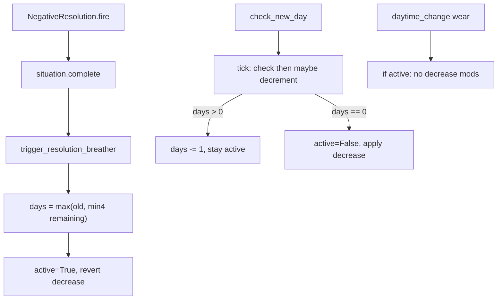

# Cascading Resolution Breather

## Verhalten (festgelegt)

- **Trigger:** nur `SituationNegativeResolution.fire()` — nicht positiv, nicht Deadline.
- **Dauer:** `min(4, Anzahl aktiver Situationen nach complete())`. Letzte Situation failt → 0 → kein Breather.
- **Inklusiv-Semantik:** N=1 = aktueller Tag + nächster Tag. Erreicht durch **Pause-End-Check vor dem Dekrement** (kein Skip-Flag).
- **Verlängerung:** `days = max(aktuell, neu)` — nie Summe; kein Extra-State nötig.
- **Was pausiert:** nur Bar-`regular_decrease`. Events, Passives, Measures, Stat-Weights laufen weiter.
- **Anzeige:** Situations-Journal ([`journal_situations`](game/scripts/journal/journal.rpy)), über der Liste, fiktional + Restdauer.

### Day-Change-Tick — Check vor Dekrement

Kein `skip_tick`. Stattdessen entscheidet der Check **vor** dem Dekrement, ob die Pause weiterläuft oder endet — dadurch entsteht automatisch der inklusiv benötigte Extra-Tag:

```
tick_resolution_breather():
    if not active:
        return
    if days > 0:
        # Pause geht weiter (dieser Day-Change zählt noch als Pausentag)
        days -= 1
    else:
        # Counter war schon 0 → Pause endet jetzt
        active = False
        resume decrease mods
```

**Warum das die Nacht-Falle löst (N=1, Fail Nacht X):**

| Zeitpunkt | days | active | Wear |
|-----------|------|--------|------|
| Fail Nacht X | 1 | True | aus |
| Day-Change X→X+1 | check `1 > 0` → weiter, dann `0` | True | aus (ganzer X+1) |
| Day-Change X+1→X+2 | check `0 > 0` → Ende | False | an |

**N=2, Fail Morgen X:** Rest X + X+1 + X+2.

| Zeitpunkt | days nach Tick | active |
|-----------|----------------|--------|
| Fail | 2 | True |
| X→X+1 | 1 | True |
| X+1→X+2 | 0 | True |
| X+2→X+3 | — | False (Ende) |

**Verlängerung:** `days = max(days, new)` während `active`. Kein Flag-Reset. Beispiel: Rest `days=0` aber noch finaler Pausentag (`active`) + neuer Fail liefert 3 → `days=3`, Pause läuft weiter ohne Sonderfall.

**Zwei Felder:**

| Feld | Bedeutung |
|------|-----------|
| `resolution_breather_days` | Counter (0–4) |
| `resolution_breather_active` | Pause läuft (auch wenn Counter schon 0 am finalen Tag) |

`is_resolution_breather_active()` liest das **active-Flag**, nicht `days > 0` — sonst würde Wear am Morgen nach `1→0` wieder angehen.

**Anzeige:** `days` solange `days > 0`, am finalen Tag (`active` und `days == 0`) weiterhin **1** — damit „Noch 1 Tag“ den letzten vollen Pausentag abdeckt.



## Code-Änderungen

### 1. Manager-API — [`game/scripts/situations/situations.rpy`](game/scripts/situations/situations.rpy)

In `SituationManager.__init__`: `self.resolution_breather_days = 0`, `self.resolution_breather_active = False`.

Methoden:

- `count_active_situations()` — `state == "active"` und nicht `invalid`
- `is_resolution_breather_active()` — `getattr(self, "resolution_breather_active", False)` (Save-Compat)
- `get_resolution_breather_display_days()` — `days if days > 0 else (1 if active else 0)`
- `trigger_resolution_breather()` — `new = min(4, count)`; bei `new > 0`: `days = max(days, new)`; `active = True`; suspend falls nötig
- `tick_resolution_breather()` — Check-vor-Dekrement wie oben
- `_suspend_all_decrease_modifiers` / `_resume_all_decrease_modifiers`

### 2. Fire-Hook

`SituationNegativeResolution.fire()`:

```python
def fire(self) -> bool:
    result = super().fire()
    if result and situation_manager is not None:
        situation_manager.trigger_resolution_breather()
    return result
```

`complete()` in `super().fire()` zuerst → Zählung ohne die gescheiterte Situation.

### 3. Wear-Gate

In `SituationBar.apply_decrease_modifier`: wenn `is_resolution_breather_active()` → `revert_decrease_modifier()` und return.

### 4. Day-Change — [`game/scripts/daily_check.rpy`](game/scripts/daily_check.rpy)

Anfang von `check_new_day` (vor daily modifiers):

```renpy
$ situation_manager.tick_resolution_breather()
```

`check_new_daytime` unverändert (kein Counter-Tick).

### 5. UI — [`game/scripts/journal/journal.rpy`](game/scripts/journal/journal.rpy)

Banner über Active/Completed wenn active; Text fiktional + `get_resolution_breather_display_days()`.

### 6. Docs — [`situation_authoring_guide.md`](game/scripts/situations/situation_authoring_guide.md) §15

Konkrete Semantik (nur Grundverschleiß, Trigger, Max-4, Max-Verlängerung, Check-vor-Dekrement). Optional Kurzhinweis in [`situation_system_concept.md`](game/scripts/situations/situation_system_concept.md).

## Nicht im Scope

- Kein Umbau von Resolution-/Modifier-Systemen
- Keine Pause von Events, Passives, Measures, Threshold-Timern oder Stat-Weights
- Kein Breather bei positiv/Deadline
