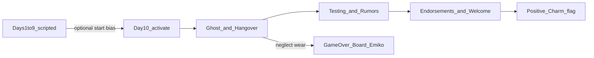

# Tutorial Situation: New Management (narrative redesign)

## What changed from the previous draft

The first draft mapped **one pool / one gate per mechanic** (patrol tutorial, counseling tutorial, …). That is a checklist quest wearing Situation clothes — rejected.

**New spine:** the Situation asks one dramatic question — *"Does this school still have a headmaster?"* — answered by **presence**. The bar is **Standing**. Event pools are **mood bands** of the campus. Mechanics are learned because the story *needs* them in those moods, not because a gate demands EventSeen X.

---

## Locked decisions (unchanged)

| Topic | Choice |
|-------|--------|
| Activation | Day 10 free-roam (`first_week_epilogue_final.skip` + skip-to-free-roam) — Days 1–9 stay scripted intro |
| Teaser phase | Chronicle-only: 13 SituationTeasers unlock during/after activation as pool/threshold events are seen |
| Language | English |
| Passives / Measures | Yes — Guided vs Self-Directed; Measures replay Map/Journal/Action UI tutorials |
| Scope | Full Situation + full event content |
| `SituationPoolCondition` | Already present — use it |

Intro still **feeds** the Situation: description + early pool tone reference the potion hangover; optional `shift_start_value` from first-week facility visits.



---

## Through-line and cast

**Dramatic question:** Does this school still have a headmaster?

**Emotional answer:** Legitimacy through *being seen doing the job* — climate, not a speech.

### Level contrast (critical for tone)

At free-roam start (`first_week_epilogue`): **school / teachers / parents = Level 1**, **Emiko (secretary) = Level 5**.

| | Level 1 campus | Emiko L5 |
|--|----------------|----------|
| Mood | Pure, modest, uncomfortable with anything sexual; polite distance | Promiscuous, frank, little concern for propriety |
| Potion week | Diluted dose → fuzzy memory, residual blush/unease they *don't understand* | Full dose → she remembers; intimate with the headmaster; must self-censor in public |
| Tutorial voice | Confused students / cautious teachers ask for structure | Emiko guides diegetically — warm, dry, sometimes too forward when alone, professional mask around staff |

Author rule: L1 scenes never jump to explicit sexual framing. Hangover beats = memory gaps, unexplained flushing, nervousness. Emiko's private lines can be sharper; in front of Yulan/Lily/students she dials back.

### Recurring cast (real roster — [character.mdc](.cursor/rules/character.mdc))

| Role | Character | Why |
|------|-----------|-----|
| Mentor / loyalty barometer | **Emiko Langley** (secretary, L5) | Already knows him from intro; coffee, held stacks, eye contact; Game Over disappointment lands hardest on her |
| Staff weathervane | **Yulan Chen** (History/Politics, teacher PTA rep) | Political skeptic; cold silence → nod → favor / or escalates toward the Board on neglect |
| Shaken science teacher | **Lily Anderson** (Math/Sciences) | Counseling hangover beat + curriculum/teach math cover; L1 discomfort with "what happened last week" |
| Gym presence | **Zoe Parker** (PE/Health) | Coach nod / gym patrol / Bench Press Bargain witness |
| Soft staff warmth | **Finola Ryan** / **Chloe Garcia** | Staff-room mug, secondary hall greetings |
| Student litmus / "prefect" | **Yuriko Oshima** (student rep) | Clipboard policy probes → returns with student answers; PTA mouthpiece |
| Bold tester / rumor fuel | **Aona Komuro** | "Isn't that the janitor?", chalk portrait, kiosk ranking — status energy without inventing a new girl |
| Memory-gap / care channel | **Miwa Igarashi** | Continuity from `first_week_epilogue_final` (memory gap after potion); check_class + counseling arc |
| PTA shadow | **Adelaide Hall** (parent PTA speaker) | Envelopes / calls; concerned-observer pressure; supportive note at high Standing |
| Secondary parents | **Nubia Davis**, **Yuki Yamamoto** | Message Backlog parent calls |

**Out of scope for this Situation:** **Linh Nguyen** (nurse) — introduced at School Level 2; do not appear in any tutorial beat. Hangover redirects stay with Emiko / Lily / counseling desk, not the clinic.

**Motifs:** wrong nameplate → correct plaque; potion residue / sweet corridor smell fading; bulletin board content; Emiko's coffee (one cup → two); Yulan's withheld nod; Yuriko's clipboard.

---

## Bar

- Key: `main` (Standing)
- Limits: `(-25, 40)` — short 1–2 week arc
- `start_base`: `0` (plus optional first-week shifts)
- Wear: `regular_decrease_rate=-0.4` / `daytime_change` — AFK drifts to Game Over; normal play climbs
- `stat_weights`: `{REPUTATION: 0.4, HAPPINESS: 0.3, EDUCATION: 0.2, CHARM: 0.2}`

No BlockingThresholds. Exploration stays open; the world *reacts*.

---

## Thresholds = campus reactions (Auto only)

Each AutoThreshold fires a short **EventEffect** scene (or Progress/GameData seed). Diary `approach_hint` only — no UI meta.

| Value | Dir | approach_hint (draft) | Story beat on fire | Implicitly surfaces |
|------:|-----|----------------------|--------------------|---------------------|
| −12 | down | "Emiko has stopped hiding the pink slips. Parent messages are stacking. She hasn't said anything — she doesn't have to." | Emiko soft-nudge: coffee + diegetic walkthrough of *options today* tied to school state (patrol / desk / class / counseling as fiction, not UI arrows) | All four verbs as *choices she names* |
| −20 | down | "One more empty stretch and someone at the district picks up the phone." | Letter framed as Adelaide/parent concern (or anonymous observer); Emiko's L5 mask slips into private worry; ghost/hangover pools get louder | Neglect has a floor; Journal matters |
| −25 | — | (resolution) | NegativeResolution → Game Over (Emiko packing, L5 intimacy makes her disappointment cut) | Absentee headmaster |
| +5 | up | "Emiko wished me luck this morning without being asked. Small thing. Not nothing." | Private warmth from Emiko (L5 can be a beat too close, then she corrects herself before anyone enters) | Positive engagement recolors ordinary actions |
| +15 | up | "Yulan stopped me between periods — the students are settling. She sounded like she'd been holding her breath." | Yulan half-thaws; Miwa (or a classmate) *seeks you out* toward counseling | Counseling as earned channel |
| +25 | up | "They've dropped the word 'new'. I'm just 'the headmaster' now." | Adelaide-friendly PTA note (`pta_aware` seed); Finola/Chloe start using the title cleanly | Situations hand off via Journal seeds |
| +36 | up | "The paperwork calls me headmaster. No qualifiers." | Near-end — plaque / Finola mug raised foreshadow | Closure motifs |
| +40 | — | (resolution) | PositiveResolution | Legitimacy held |

Optional seeds on fire (for later Situations' Teasers): `nm_presence_felt`, `nm_care_channel`, `pta_aware`, `nm_desk_trusted`.

**Grace:** `NegativeResolution(..., grace_count=1)` — one recovery touch at the floor before Game Over fires for real.

---

## Event pools = narrative mood bands (not mechanic labels)

Pools define **overlapping Standing bands**. The same building action yields *different* scenes depending on the band. A campus-wide mood emerges because several buildings inject into the same band at once.

### 1. `nm_ghost_office` (−25 … −8) — "Nobody knows who the new guy is"

Theme: He is an abstraction; the office feels borrowed.

**Why "janitor" works despite the Day 1 assembly speech:** The intro gave students the *title* ("new headmaster"), not a stable *face*. Gym assembly was one crowded moment; after the potion week, many students carry fuzzy gaps (Miwa explicitly in epilogue). Low Standing means the player has not been *seen* around campus — so hallway encounters load the wrong role. This is **not** "they never heard of a headmaster"; it is "they heard the word, but this man in work clothes by the office annex doesn't match the memory." Visual anchors fail: wrong nameplate, borrowed office, no regular patrol presence. The beat teaches patrol as *making the title stick to a face*.

Injects: `office look_around`, `call_secretary`, `courtyard patrol`, `school patrol`

| Event | Where | Pitch | Mechanic shown | Δ |
|-------|-------|-------|----------------|---|
| The Nameplate That Isn't | look_around | Previous headmaster's name still on the door; a taped, misspelled printout covers part of it — the campus literally labels the office wrong. Fix it, ask Emiko, or leave it. (Sets up why students map "guy near that door" → maintenance, not headmaster.) | Reading the office | +2 / 0 / −1 |
| Isn't That the Janitor? | courtyard patrol | **Aona** (and a classmate) discuss him three feet away: "There *is* a new headmaster — we sat through the speech — but that's not him, that's the maintenance guy." They remember the assembly as a blur, not a face. Introduce yourself / walk past / snap. If he introduces himself, Aona freezes: "Oh. You're *real*." | Patrol = visibility; title → face | +3 / +1 / −2 |
| Private Line, Public Mask | call_secretary | Emiko *does* know his voice (L5 intimacy) — she answers too warmly, then snaps into secretary mode when she hears hallway footsteps | call_secretary as channel + L5/L1 contrast | +3 / +1 / 0 |
| The Empty Corridor | school patrol | Passing bell; **Yulan** doesn't look up from her folder when he passes | School patrol as territory / staff freeze-out | +2 / +1 / −1 |

### 2. `nm_potion_hangover` (−20 … +5) — "Shaken, not hostile"

Theme: Distrust aims at last week, not at him. L1 campus: confusion and modesty, not erotic framing.

Injects: `check_class`, `teach_class`, `courtyard search`, `work/counselling`

| Event | Where | Pitch | Mechanic shown | Δ |
|-------|-------|-------|----------------|---|
| The Girl Who Missed Monday | check_class | **Miwa** vacant; can't remember Tuesday morning (continuity from epilogue) — reassure / note counseling / press | check_class as diagnostics | +4 / +2 / −2 |
| Lily's Coffee Mug Is Shaking | counselling | **Lily Anderson** unscheduled, L1-nervous: "Was last week… real?" — sit with her / deflect / keep it professional (no nurse redirect; Linh is L2+) | Counselling as pressure valve | +5 / +2 / 0 |
| The Vial in the Hedge | courtyard search | Glass residue by the bike rack — bag / note / call Emiko | Search as evidence | +3 / +1 / −1 |
| Class of Blushing Sleepers | teach_class | Covering for Lily; three 3A students flush mid-lesson with no idea why (L1 confusion) | Teach under lingering sensitivity | +3 / +4 / 0 |

### 3. `nm_testing_the_waters` (−5 … +20) — "Probing his edges"

Theme: Campus has registered him and is learning what kind of headmaster he is.

Injects: `teach_class`, school/courtyard/gym `patrol`, `work/reputation`

| Event | Where | Pitch | Mechanic shown | Δ |
|-------|-------|-------|----------------|---|
| The Rep With the Clipboard | courtyard/school patrol | **Yuriko** intercepts with grey-area policy questions (dress, phones, dating) — answers become precedents | Patrol carrying lasting flags | +3 / −3 |
| The Perfect 30 Seconds | teach_class | 3A performs only while his gaze holds; whispers when he looks at notes | Teach = sustained presence | +4 / +2 / −1 |
| Bench Press Bargain | gym patrol | Almost-illicit bet under **Zoe**'s roof; stare / mild warning / heavy intervene | Quiet gym enforcement | +3 / +1 / −2 |
| First Memo | work/reputation | Blank school-wide memo (Emiko may have slid the template); emphasis tags lasting tone | Desk work as authorial voice | +4 / +1 |

### 4. `nm_rumors_in_bloom` (0 … +25) — "He is a topic now"

Theme: Gossip becomes a resource (L1 gossip = naive ranking / crush talk, not explicit).

Injects: `kiosk look_around`, courtyard/school `search`, `call_secretary`

| Event | Where | Pitch | Mechanic shown | Δ |
|-------|-------|-------|----------------|---|
| Coke and Overhear | kiosk | **Aona** + friends rank staff; he's #3 and someone says "That's the headmaster from the assembly — I recognize him now." (Callback: janitor confusion resolved once Standing rises.) — intervene / listen / leave with intel | Kiosk ambient intel; face now sticks | +3 / +1 / −1 |
| The Folded Note in Aisle Three | school search | Passed note (3A hands) — pocket / return / discard | Search = student voice | +3 / +1 / 0 |
| Chalk Portrait | courtyard search | Bike-shed drawing (Aona's circle energy) — caricature ↔ portrait by Standing | World mirrors the bar | +3 / +2 / −2 |
| Message Backlog | call_secretary | Emiko stacks **Adelaide** / **Nubia** / **Yuki** / a reporter — who you return carries forward | Triage via Emiko | +3 / +2 / −2 |

### 5. `nm_quiet_endorsements` (+10 … +30) — "The new guy is becoming the headmaster"

Theme: Individuals treat him as *the* headmaster.

Injects: `check_class`, `work/education`, `counselling`, gym/courtyard `patrol`

| Event | Where | Pitch | Mechanic shown | Δ |
|-------|-------|-------|----------------|---|
| Coach Nods | gym patrol | **Zoe** chin-lifts across the mats; room settles | Minimal-gesture atmosphere | +3 / +2 / 0 |
| After the Bell | check_class | **Miwa** (or a quiet 3A peer) thanks him for last week, leaves before he can answer | Emotional payoff of checking in | +5 / +3 / +1 |
| The Curriculum Draft | work/education | **Lily** returns his outline: "Actually… better." (L1 awkward praise) | Education desk as authorship | +4 / +3 / +1 |
| Second Coffee | counselling | **Lily** returns about her weekend — trust, not crisis; Emiko may smirk privately afterward | Counselling as relationship track | +5 / +3 / +1 |
| The Rep Comes Back | courtyard patrol | **Yuriko** returns with a folded list of *students' answers* to his earlier precedents | Callback to testing pool | +4 / +3 / −1 |

### 6. `nm_welcome_committee` (+22 … +40) — "Legitimacy rituals"

Theme: Campus brings him real work because it trusts him.

Injects: `work/money`, `work/reputation`, `look_around`, `teach_class`, courtyard `patrol`, `call_secretary`

| Event | Where | Pitch | Mechanic shown | Δ |
|-------|-------|-------|----------------|---|
| A Mug Raised in the Staff Room | teach aftermath / reputation | **Finola** (or Chloe): "To surviving your first week. Good luck with the job, headmaster." **Yulan** may almost smile | Social payoff | +6 / +4 / +2 |
| Budget Green-Lit | work/money | Modest purchase; **Zoe** or **Lily** thanks him later | Money work as permission | +4 / +3 / +2 |
| The Plaque Arrives | look_around | Engraved brass; Emiko watches too long (L5) then jokes it off — bookends Nameplate | Cosmetic closure | +3 / +2 |
| Assembly, Actually | courtyard patrol | Proper morning line; **Yuriko** helped without being told. Optional Aona beat: she greets him by title, not "maintenance guy" — bookends Janitor beat | Ceremonial patrol; title fully earned | +5 / +4 / +3 |
| Adelaide Calls Back | call_secretary | Emiko hands him Adelaide's follow-up — tone depends on Message Backlog; reporter variant optional | Long-arc consequence | +4 / +3 / +2 |

**Why this beats mechanic-keyed pools:** every band can inject into *several* buildings, so mood is campus-wide. Mechanics appear as the natural verbs of that scene. Climbing Standing changes *what the world says*, not which checkbox unlocks.

**Janitor arc resolution (Standing progression):**

| Band | What students say |
|------|-------------------|
| `nm_ghost_office` (−25…−8) | "There's a new headmaster… but that's the janitor." |
| `nm_potion_hangover` / `nm_testing` | "Wait, was he at the assembly? I think so?" — uncertainty, not denial |
| `nm_rumors_in_bloom` (+0…+25) | "That's him. From the speech. I recognize him now." (Aona kiosk beat) |
| `nm_welcome_committee` (+22…+40) | Greeted by title; Aona optional callback uses "headmaster" cleanly |

Author rule: never write as if the assembly never happened. Always acknowledge the speech existed; the gap is **face + presence + potion blur**, not ignorance of the role.

---

## Guided Mode companions (passive flag, not a checklist)

When `new_management_guided = 1`, each band may show **one** extra soft companion (diegetic tip, never UI meta):

- Ghost → Emiko (alone): "The last one walked the courtyard every morning. Just saying."
- Hangover → Lily leaving counseling: "They calm down when someone actually… looks."
- Testing → Emiko slides a blank memo template into his hands without comment
- Rumors → Emiko (phone triage): "Kiosk hears everything. So do I."
- Endorsements → Zoe in the hallway: "Gym's quieter when you drop in."
- Welcome → Emiko with the plaque crate: "Your name. Spelled right this time."

Self-Directed: companions off; full wear; same main pools.

Passives (net wear stays negative under Guided):

- `guided_orientation` — SetGameData guided=1 + small `BarChangeModifier(+0.15)` vs wear −0.4
- `self_directed` — guided=0

Default on activate: `set_passive("guided_orientation")`.

Measures (meta only — separate from narrative): `review_map` / `review_journal` / `review_actions` → EventEffect to existing tutorial labels; short TimerCondition duration + cooldown; **no** ManualCounterCondition.

---

## Chronicle Teasers (13) - SituationTeasers as story documentation

Goal: Use Teasers not just for "teasing", but as chronicle-style Notes that document what the player triggered (Nameplate -> Janitor confusion -> Potion hangover -> murmurs -> earned titles -> plaque and legitimacy).

How to read: each teaser unlocks when at least one referenced `EventSeenCondition(...)` becomes true.

TEASERS:
- nm_wrong_face | OR(EventSeenCondition("nm_ghost_office_nameplate"), EventSeenCondition("nm_ghost_office_janitor")) | observation | - | Someone printed my name — wrong spelling, wrong tape.
Students outside were pointing at the janitor.
The office doesn't label me. Neither do they.
- nm_private_line | EventSeenCondition("nm_ghost_office_private_line") | suspicion | - | Emiko answered too warmly on the phone.
Her voice snapped tight when footsteps passed.
She knows me privately; performs the distance publicly.
- nm_frozen_hallway | EventSeenCondition("nm_ghost_office_empty_corridor") | setback | - | Yulan didn't lift her eyes when I passed.
The corridor kept its temperature.
Silence as verdict. Staff won't grant a title on air.
- nm_miwa_gap | EventSeenCondition("nm_potion_hangover_miwa") | setback | - | Miwa couldn't remember Tuesday morning.
Her notebook was blank where the week should be.
The potion took the day; no one has offered her one back.
- nm_lily_shaken | EventSeenCondition("nm_potion_hangover_lily") | observation | - | Lily's mug rattled against the desk.
She asked if last week was real.
The staff need a witness before they can name it.
- nm_vial_found | EventSeenCondition("nm_potion_hangover_vial") | insight | image=images/journal/rules/Level_10_full.webp,layout=photo_left | Green glass by the bike rack, sticky at the neck.
Same smell as the corridor last Tuesday.
The evidence didn't leave. It just stopped being obvious.
- nm_pink_slips | OR(EventSeenCondition("nm_thresh_emiko_nudge"), EventSeenCondition("nm_thresh_district_letter")) | setback | - | Pink slips no longer hidden — Emiko stopped filing them.
One was signed 'concerned observer'.
Neglect has a paper trail. The floor is close.
- nm_clipboard_precedents | OR(EventSeenCondition("nm_testing_the_waters_clipboard"), EventSeenCondition("nm_testing_the_waters_memo")) | suspicion | - | Yuriko asked three questions with grey answers.
My words were on paper before lunch.
Casual replies are precedents now. She's mapping the office.
- nm_face_sticks | EventSeenCondition("nm_rumors_in_bloom_kiosk") | observation | - | "That's him from the assembly — I remember now."
Aona corrected herself mid-sentence.
The face has caught up with the title. It sticks now.
- nm_chalk_portrait | EventSeenCondition("nm_rumors_in_bloom_chalk") | observation | image=images/journal/rules/Level_10_full.webp,layout=photo_right | A chalk portrait behind the bike shed.
Roughly me — and, oddly, flattering.
The world is drawing me back in.
- nm_yulan_thaw | OR(EventSeenCondition("nm_thresh_yulan_thaw"), EventSeenCondition("nm_thresh_first_warmth")) | insight | - | Yulan stopped me between periods.
The students are settling, she said, quietly.
Staff temperature is rising. Legitimacy earned in pieces.
- nm_care_channel | OR(EventSeenCondition("nm_quiet_endorsements_after_bell"), EventSeenCondition("nm_quiet_endorsements_second_coffee"), EventSeenCondition("nm_quiet_endorsements_curriculum")) | insight | - | Miwa thanked me and left before I could answer.
Lily returned my outline: "Actually… better."
Care flowed and returned. The channel opened both ways.
- nm_title_earned | OR(EventSeenCondition("nm_welcome_committee_plaque"), EventSeenCondition("nm_welcome_committee_mug"), EventSeenCondition("nm_welcome_committee_assembly"), EventSeenCondition("nm_thresh_adelaide_note"), EventSeenCondition("nm_thresh_near_end")) | insight | image=images/journal/rules/Level_10_full.webp,layout=photo_top | The plaque arrived with my name spelled right.
Finola raised her mug in the staff room.
The word 'new' has fallen off. I'm just 'the headmaster' now.

EVENT_KEYS:
- nm_ghost_office_nameplate | nm_ghost_office | office look_around: previous head's name still on the door, taped misspelled printout over it.
- nm_ghost_office_janitor | nm_ghost_office | courtyard patrol: Aona insists that's the maintenance guy, not the new headmaster.
- nm_ghost_office_private_line | nm_ghost_office | call_secretary: Emiko warm on the phone, snaps into secretary mode when footsteps pass.
- nm_ghost_office_empty_corridor | nm_ghost_office | school patrol: Yulan doesn't look up from her folder as he passes.
- nm_potion_hangover_miwa | nm_potion_hangover | check_class: Miwa vacant, can't remember potion morning (epilogue continuity).
- nm_potion_hangover_lily | nm_potion_hangover | counselling: unscheduled Lily asks if last week was real.
- nm_potion_hangover_vial | nm_potion_hangover | courtyard search: glass residue and sweet smell by the bike rack.
- nm_testing_the_waters_clipboard | nm_testing_the_waters | patrol: Yuriko intercepts with grey-area policy questions that become precedents.
- nm_testing_the_waters_memo | nm_testing_the_waters | work/reputation: first blank school-wide memo; Emiko may slide the template.
- nm_rumors_in_bloom_kiosk | nm_rumors_in_bloom | kiosk look_around: Aona group ranks staff; someone recognizes him from the assembly.
- nm_rumors_in_bloom_chalk | nm_rumors_in_bloom | courtyard search: chalk portrait behind bike shed (Aona circle energy).
- nm_quiet_endorsements_after_bell | nm_quiet_endorsements | check_class: Miwa thanks him and leaves before he can answer.
- nm_quiet_endorsements_second_coffee | nm_quiet_endorsements | counselling: Lily returns about her weekend, trust not crisis.
- nm_quiet_endorsements_curriculum | nm_quiet_endorsements | work/education: Lily returns his outline with awkward praise: "Actually… better."
- nm_welcome_committee_mug | nm_welcome_committee | teach aftermath / reputation: Finola (or Chloe) raises a mug; Yulan nearly smiles.
- nm_welcome_committee_plaque | nm_welcome_committee | office look_around: engraved brass plaque delivered; Emiko watches too long then jokes it off.
- nm_welcome_committee_assembly | nm_welcome_committee | courtyard patrol: proper assembly line; Yuriko helped without being told.
- nm_thresh_emiko_nudge | threshold scene | EventEffect: Emiko soft-nudge, pink slips stack, district phone pressure.
- nm_thresh_district_letter | threshold scene | EventEffect: Adelaide/concerned letter or anonymous observer; district call pressure escalates.
- nm_thresh_first_warmth | threshold scene | EventEffect: Emiko's private good-luck moment, then public mask.
- nm_thresh_yulan_thaw | threshold scene | EventEffect: Yulan half-thaws between periods; counselling channel opens.
- nm_thresh_adelaide_note | threshold scene | EventEffect: Adelaide-friendly PTA note; sets `pta_aware` seed.
- nm_thresh_near_end | threshold scene | EventEffect: near-end plaque and Finola-mug foreshadow; paperwork calls him headmaster.

---

## Resolutions

**Positive** at +40:

- `ValueEffect("new_management_resolved", "positive")`
- `EventEffect("new_management_positive_resolve")` — Emiko, two coffees, Board endorsement tone; `change_stat(CHARM, 5)`

### Optional follow-up seed: `management_style` (not required for v1)

**What it means:** a soft tag for *how* the player earned Standing — not a second win condition and not a punishment. Later Situations can read it to tint Emiko/Yulan/Yuriko lines (e.g. a desk-heavy headmaster gets more paperwork jokes; a presence-heavy one gets warmer courtyard NPCs). The tutorial still ends the same (Charm +5 + positive flag).

**How it would be chosen (automatic, no menu):** during the Situation, each core pool event increments a counter for its “lean”:

| Lean | Typical events |
|------|----------------|
| `presence` | courtyard/school/gym patrol, assembly, janitor/Aona beats |
| `care` | counselling, Miwa/Lily care beats, After the Bell |
| `paper` | office work (money/education/reputation), First Memo, Message Backlog |
| `classroom` | teach_class / check_class beats |

On positive resolution, set `management_style` to the lean with the **highest counter** (tie-break order: `presence` → `care` → `classroom` → `paper`). Neglect/Game Over sets `absentee` instead (or simply leaves the key unset).

**v1 recommendation:** ship **without** `management_style` — only `new_management_resolved`. Add counters + the tag in a follow-up once the pools exist and we know which events feel “lean-defining.” Do **not** block the tutorial on this.

---

## Activation / files

1. [`game/scripts/situations/situations.rpy`](game/scripts/situations/situations.rpy) — `Situation("new_management", …)` with `SituationDescription`, Bar, AutoThresholds (+ EventEffects), passives, measures, six `SituationPool`s, resolutions
2. [`game/scripts/events/new_management.rpy`](game/scripts/events/new_management.rpy) — **new**: all pool events (high priority + `SituationPoolCondition` + `IntroCondition(False)`), threshold scenes, resolve/Game Over labels, `init 1` storage registration
3. [`game/scripts/daily_check.rpy`](game/scripts/daily_check.rpy) — activate + Guided default + short standing beat in `.skip`
4. [`game/scripts/events/intro_events.rpy`](game/scripts/events/intro_events.rpy) — optional `shift_start_value` on first_week visits

Use the cast table above (no invented names). Access via `get_person` / person keys from `character.rpy` (`emiko_langley`, teachers under staff, class_3a students, parents). Images: existing Patterns/BGs; no hard art dependency. Respect L1 dialogue for everyone except private Emiko beats.

---

## Code shape (skeleton)

```python
Situation("new_management", "New Management",
    SituationDescription([
        "The extreme potion effects of the first week have faded. Memories are fuzzy — a vague unease remains.",
        "Teachers are cautious, students test boundaries, parents watch. The school is deciding whether it still has a headmaster.",
    ]),
    Bar("main", limits=(-25, 40), start_base=0, regular_decrease_rate=-0.4,
        stat_weights={REPUTATION: 0.4, HAPPINESS: 0.3, EDUCATION: 0.2, CHARM: 0.2}),
    AutoThreshold("…pink slips…", EventEffect("nm_thresh_emiko_nudge"), main=-12, direction=-1),
    AutoThreshold("…district phone…", EventEffect("nm_thresh_district_letter"), main=-20, direction=-1),
    AutoThreshold("…Emiko wished me luck…", EventEffect("nm_thresh_first_warmth"), main=5),
    AutoThreshold("…students are settling…", EventEffect("nm_thresh_yulan_thaw"), main=15),
    AutoThreshold("…dropped the word new…", EventEffect("nm_thresh_adelaide_note"), main=25),
    AutoThreshold("…no qualifiers…", EventEffect("nm_thresh_near_end"), main=36),
    PassiveOption("guided_orientation", "…",
        SituationEffectSetGameData("new_management_guided", 1, "Guided tips on"),
        SituationEffectBarChangeModifier("main", 0.15, "+", "daytime_change")),
    PassiveOption("self_directed", "…",
        SituationEffectSetGameData("new_management_guided", 0, "Guided tips off")),
    # Measures: review_map / review_journal / review_actions …
    SituationPool("nm_ghost_office", -25, -8),
    SituationPool("nm_potion_hangover", -20, 5),
    SituationPool("nm_testing_the_waters", -5, 20),
    SituationPool("nm_rumors_in_bloom", 0, 25),
    SituationPool("nm_quiet_endorsements", 10, 30),
    SituationPool("nm_welcome_committee", 22, 40),
    PositiveResolution("ALL",
        ValueEffect("new_management_resolved", "positive"),
        EventEffect("new_management_positive_resolve")),
    NegativeResolution("ANY",
        ValueEffect("new_management_resolved", "negative"),
        EventEffect("game_over_new_management"),
        grace_count=1),
)
```

Events register with `SituationPoolCondition("new_management", "nm_ghost_office")` etc.; Guided companions also need `GameDataCondition("new_management_guided", 1)`.

---

## Beginner feel (mood arc, not checklist)

Mon–Tue: ghost/hangover — Aona doesn't know his face; Miwa's memory gap; Lily rattled; Emiko too knowing in private.  
Wed: first warmth AutoThreshold if they've been present.  
Thu–Fri: testing + rumors — Yuriko's clipboard, Yulan thawing, Adelaide messages.  
Week 2: endorsements → welcome (Zoe nod, Finola mug, plaque) → resolution. Neglect: pink slips → Adelaide/district pressure → Game Over with Emiko.

Lopsided play (only teach, never desk, etc.) still resolves if Standing climbs. Characterization via optional later `management_style` seed (see Resolutions) — not a fail state.

---

## Test plan

1. Skip to free-roam → Situation active, Guided on, Journal shows New Management.
2. Idle a few days → −12 Emiko nudge, then −20 letter, grace, then Game Over packing scene.
3. Normal roam across buildings → scenes change tone as Standing rises through the six bands; same action ≠ same scene.
4. Toggle Self-Directed → companions stop.
5. Measures still replay UI tutorials.
6. +40 → Charm +5 + `new_management_resolved == "positive"`.
7. Situation log clean (no self-test errors).
